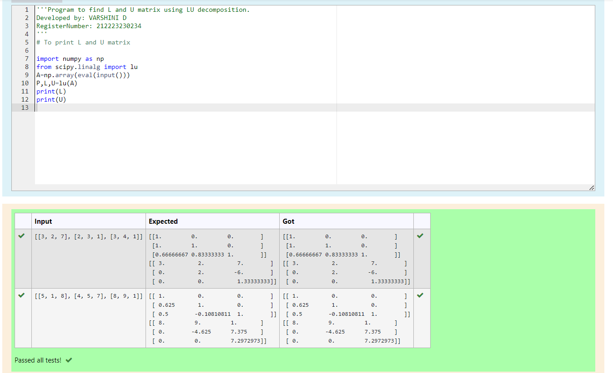
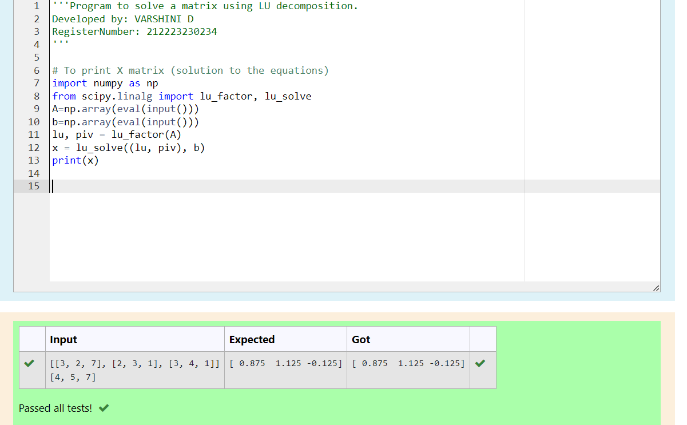

# LU Decomposition 

## AIM:
To write a program to find the LU Decomposition of a matrix.

## Equipments Required:
1. Hardware – PCs
2. Anaconda – Python 3.7 Installation / Moodle-Code Runner

## Algorithm
1. Read the elements of augmented matrix into arrays.
2. Calculate elements of L and U.
3. Print elements of L and U.
4. Find V by solving LV=B by forward substitution.

## Program:
(i) To find the L and U matrix
```
/*
Program to find the L and U matrix.
Developed by: VARSHINI D
RegisterNumber: 212223230234
*/
# To print L and U matrix

import numpy as np
from scipy.linalg import lu
A=np.array(eval(input()))
P,L,U=lu(A)
print(L)
print(U)

```
(ii) To find the LU Decomposition of a matrix
```
/*
Program to find the LU Decomposition of a matrix.
Developed by: VARSHINI D
RegisterNumber: 212223230234
*/

# To print X matrix (solution to the equations)
import numpy as np
from scipy.linalg import lu_factor, lu_solve
A=np.array(eval(input()))
b=np.array(eval(input()))
lu, piv = lu_factor(A)
x = lu_solve((lu, piv), b)
print(x)

```

## Output:
![lu decomposition]




## Result:
Thus the program to find the LU Decomposition of a matrix is written and verified using python programming.

